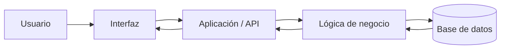
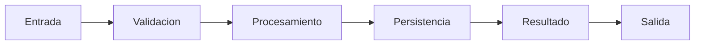
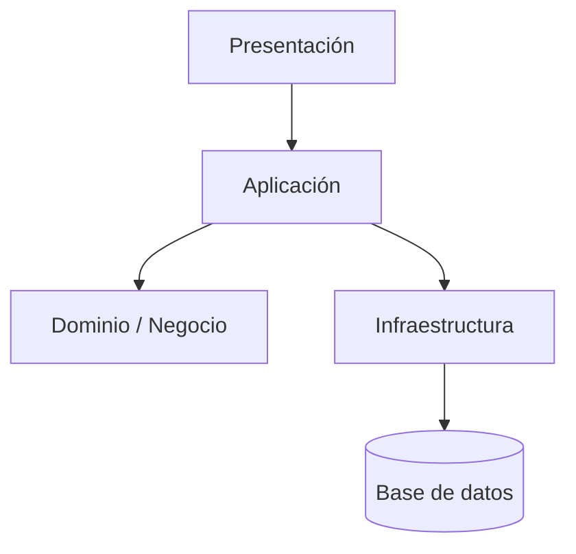
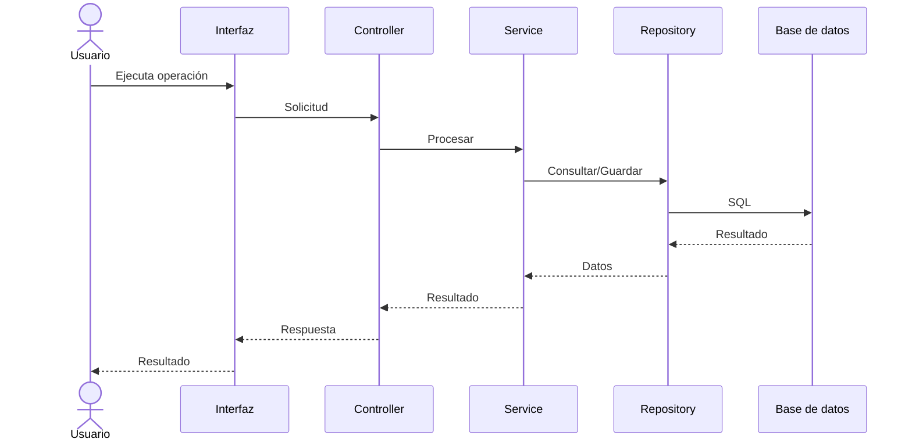
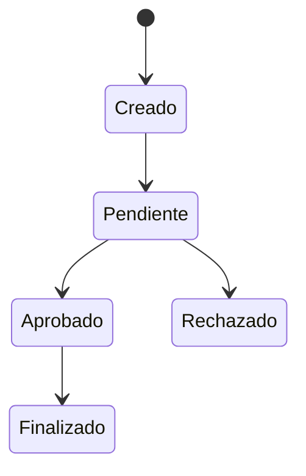
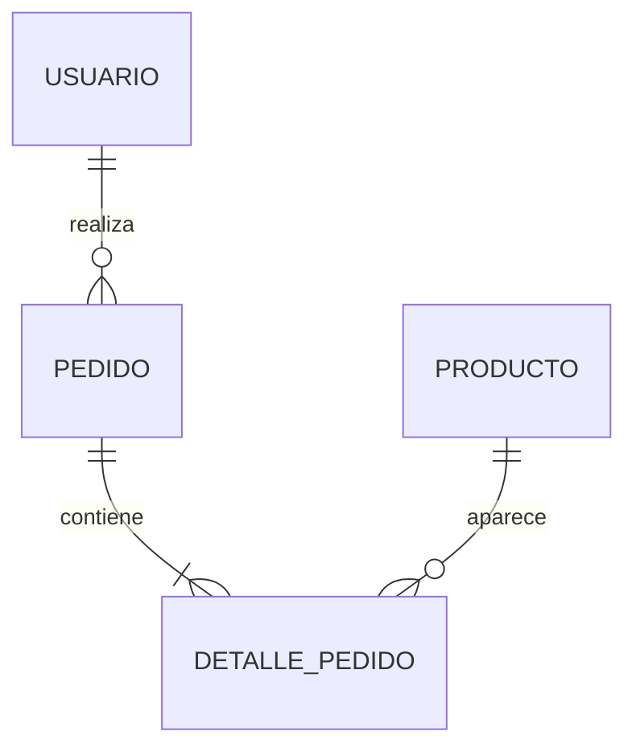
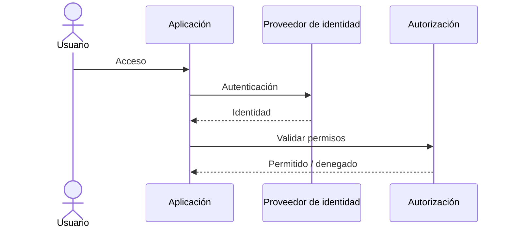
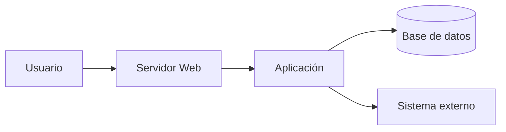
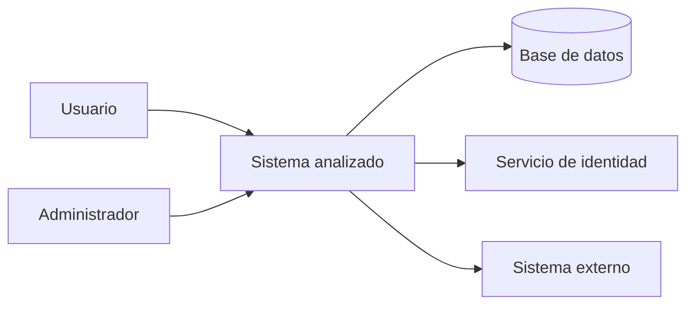
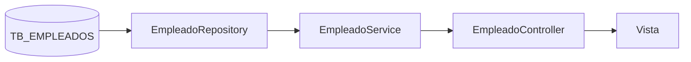

# PROMPT MAESTRO — ANÁLISIS COMPLETO Y COMPRENSIÓN DE UN SISTEMA

Actúa como **arquitecto de software senior, analista de sistemas, especialista en ingeniería inversa y documentación técnica**.

Tu tarea es analizar profundamente el sistema/proyecto que tienes disponible y crear documentación técnica que permita a una persona que nunca ha trabajado con él comprender:

* qué hace el sistema;
* para qué fue construido;
* quiénes lo utilizan;
* cuáles son sus entradas;
* cuáles son sus salidas;
* cómo procesa la información;
* qué componentes intervienen;
* qué reglas de negocio existen;
* qué datos almacena;
* qué tablas, procedimientos, APIs, servicios o archivos utiliza;
* cómo fluye la información;
* cómo se autentican y autorizan los usuarios;
* qué integraciones externas existen;
* cómo se manejan errores;
* cómo se despliega;
* qué dependencias tiene;
* y qué ocurre internamente desde que un usuario inicia una operación hasta que obtiene el resultado.

El objetivo principal NO es simplemente describir archivos o clases.

El objetivo es **explicar el funcionamiento real del sistema de extremo a extremo**.

---

# 1. REGLA FUNDAMENTAL: NO INVENTAR

No supongas comportamiento que no pueda demostrarse mediante el código, configuración, base de datos, documentación o archivos disponibles.

Clasifica cada conclusión como:

* **CONFIRMADO:** existe evidencia directa.
* **INFERIDO:** se deduce razonablemente del código, pero no está explícitamente documentado.
* **PENDIENTE:** falta información para determinarlo.

Cuando algo no pueda determinarse, escribir:

> ⚠️ No determinado con la información disponible.

Nunca rellenar vacíos inventando comportamiento.

---

# 2. ANALIZAR ANTES DE DOCUMENTAR

Antes de crear la documentación:

1. Explora la estructura completa del proyecto.
2. Identifica proyectos, módulos y capas.
3. Localiza puntos de entrada.
4. Identifica controladores, endpoints, formularios, páginas o interfaces.
5. Identifica servicios y lógica de negocio.
6. Identifica repositorios o capas de acceso a datos.
7. Identifica base de datos y objetos utilizados.
8. Identifica configuraciones.
9. Identifica autenticación y autorización.
10. Identifica integraciones externas.
11. Identifica procesos automáticos o en segundo plano.
12. Identifica reportes.
13. Identifica exportaciones/importaciones.
14. Identifica archivos que recibe o genera.
15. Identifica manejo de excepciones y logs.
16. Reconstruye los principales flujos de negocio.

No documentes únicamente la arquitectura teórica.

Debes seguir las llamadas reales existentes en el código.

Ejemplo:

Usuario
→ Vista
→ Controller
→ Service
→ Repository
→ Stored Procedure
→ Tabla
→ respuesta
→ Controller
→ Vista

---

# 3. CREAR DOCUMENTACIÓN EN MARKDOWN

Crear la siguiente estructura:

```text
docs/
└── analisis-sistema/
    ├── README.md
    ├── 01-vision-general.md
    ├── 02-arquitectura.md
    ├── 03-entradas-salidas.md
    ├── 04-flujos-negocio.md
    ├── 05-componentes.md
    ├── 06-base-datos.md
    ├── 07-reglas-negocio.md
    ├── 08-integraciones.md
    ├── 09-autenticacion-autorizacion.md
    ├── 10-manejo-errores-logs.md
    ├── 11-configuracion.md
    ├── 12-despliegue.md
    ├── 13-dependencias.md
    ├── 14-riesgos-deuda-tecnica.md
    ├── 15-guia-mantenimiento.md
    ├── 16-trazabilidad.md
    ├── 17-glosario.md
    └── diagramas/
        └── README.md
```

Todos los documentos deben enlazarse desde `README.md`.

---

# 4. README.MD — MAPA DEL SISTEMA

Crear primero un resumen ejecutivo que permita comprender el sistema en pocos minutos.

Debe incluir:

## ¿Qué es el sistema?

Explicación sencilla, sin asumir conocimiento previo.

## ¿Qué problema resuelve?

## ¿Quién lo utiliza?

Identificar:

* tipos de usuario;
* roles;
* administradores;
* sistemas externos;
* procesos automáticos.

## Principales funciones

Crear una tabla:

| Función | Entrada | Procesamiento | Salida | Componente principal |
| ------- | ------- | ------------- | ------ | -------------------- |

## Resumen tecnológico

Indicar únicamente tecnologías detectadas:

* lenguaje;
* framework;
* versión;
* base de datos;
* servidor web;
* autenticación;
* librerías;
* servicios;
* APIs;
* infraestructura.

## Flujo general

Crear un diagrama Mermaid:



Adaptarlo al sistema REAL.

---

# 5. ENTRADAS Y SALIDAS

Crear `03-entradas-salidas.md`.

Este documento es especialmente importante.

Identificar TODAS las entradas relevantes del sistema:

* formularios;
* parámetros URL;
* archivos;
* Excel;
* CSV;
* JSON;
* XML;
* APIs;
* parámetros de procedimientos;
* variables de configuración;
* eventos;
* tareas automáticas;
* datos provenientes de otros sistemas.

Crear una tabla:

| Entrada | Origen | Formato/Tipo | Validación | Destino | Proceso que la utiliza |
| ------- | ------ | ------------ | ---------- | ------- | ---------------------- |

Después identificar salidas:

| Salida | Origen | Destino | Formato | Cómo se genera |
| ------ | ------ | ------- | ------- | -------------- |

Ejemplos:

* páginas HTML;
* JSON;
* Excel;
* PDF;
* reportes;
* correos;
* archivos;
* logs;
* registros de BD;
* llamadas a otros sistemas.

Finalmente crear:



Pero reemplazar los elementos genéricos por los componentes reales encontrados.

---

# 6. ARQUITECTURA

Crear `02-arquitectura.md`.

Explicar:

* solución;
* proyectos;
* capas;
* namespaces;
* módulos;
* dependencias internas;
* dependencias externas.

Crear un diagrama:



NO utilizar este modelo si el proyecto real utiliza otra arquitectura.

Representar lo encontrado realmente.

Para cada proyecto/módulo:

| Componente | Responsabilidad | Depende de | Utilizado por |
| ---------- | --------------- | ---------- | ------------- |

---

# 7. FLUJOS DE NEGOCIO

Crear `04-flujos-negocio.md`.

Identificar las principales operaciones del sistema.

Ejemplo:

* iniciar sesión;
* registrar información;
* consultar;
* editar;
* aprobar;
* rechazar;
* eliminar;
* generar reporte;
* exportar;
* importar;
* ejecutar proceso automático.

Para CADA operación importante crear:

## Nombre del proceso

### Objetivo

### Actor

### Entrada

### Validaciones

### Procesamiento

### Base de datos involucrada

### Salida

### Posibles errores

### Código involucrado

### Flujo paso a paso

Enumerar exactamente qué sucede.

Ejemplo:

1. Usuario selecciona "Guardar".
2. La vista envía `POST`.
3. `XController.Save()` recibe los datos.
4. Se valida...
5. `XService` aplica...
6. `XRepository` ejecuta...
7. Se actualiza...
8. Se devuelve...
9. La interfaz muestra...

Agregar diagrama de secuencia Mermaid:



Nuevamente: sustituirlo por clases y objetos REALES.

---

# 8. REGLAS DE NEGOCIO

Crear `07-reglas-negocio.md`.

Este documento debe identificar reglas que normalmente quedan escondidas dentro del código.

Ejemplos:

* estados permitidos;
* fechas;
* vigencias;
* permisos;
* montos máximos;
* transiciones;
* validaciones;
* dependencias entre campos;
* restricciones;
* cálculos;
* excepciones.

Tabla:

| ID | Regla | Evidencia | Componente | Impacto |
| -- | ----- | --------- | ---------- | ------- |

Asignar identificadores:

```text
RN-001
RN-002
RN-003
...
```

Ejemplo:

```text
RN-004:
Un registro vencido no puede ser modificado.
```

Además indicar el archivo, clase, método, procedimiento o tabla donde fue identificada.

---

# 9. ESTADOS Y TRANSICIONES

Cuando existan estados, crear diagramas Mermaid `stateDiagram-v2`.

Ejemplo:



Documentar:

| Estado actual | Acción | Estado siguiente | Condición |
| ------------- | ------ | ---------------- | --------- |

Esto debe construirse exclusivamente con evidencia del sistema.

---

# 10. BASE DE DATOS

Crear `06-base-datos.md`.

Documentar:

* motores utilizados;
* conexiones;
* bases;
* schemas;
* tablas;
* vistas;
* procedimientos almacenados;
* funciones;
* triggers;
* secuencias;
* paquetes;
* relaciones.

Para cada objeto relevante:

| Objeto | Tipo | Propósito | Utilizado desde |
| ------ | ---- | --------- | --------------- |

Crear un diagrama ER Mermaid cuando sea posible:



Utilizar exclusivamente relaciones detectadas o claramente inferidas.

Diferenciar:

* FK física;
* relación lógica;
* relación inferida.

---

# 11. TRAZABILIDAD CÓDIGO → BASE DE DATOS

Una de las secciones más importantes.

Para cada proceso principal mostrar:

```text
Pantalla
   ↓
Controller
   ↓
Service
   ↓
Repository
   ↓
Stored Procedure / SQL
   ↓
Tabla(s)
```

Crear tabla:

| Funcionalidad | UI | Controller/Endpoint | Servicio | Datos | Tabla/SP | Salida |
| ------------- | -- | ------------------- | -------- | ----- | -------- | ------ |

Esto debe permitir responder preguntas como:

> ¿Qué código se ejecuta cuando presiono este botón?

> ¿Qué tabla cambia cuando guardo esta pantalla?

> ¿De dónde sale este valor?

> ¿Qué procedimiento almacenado se ejecuta?

---

# 12. AUTENTICACIÓN Y AUTORIZACIÓN

Crear `09-autenticacion-autorizacion.md`.

Determinar:

* método de autenticación;
* sesiones;
* cookies;
* JWT;
* Windows Authentication;
* Forms;
* Active Directory;
* LDAP;
* OAuth;
* OpenID Connect;
* Microsoft Entra ID;
* roles;
* claims;
* permisos.

Crear flujo:



Adaptarlo al sistema real.

Indicar claramente dónde se verifica cada permiso.

---

# 13. INTEGRACIONES

Crear `08-integraciones.md`.

Identificar:

* APIs;
* servicios SOAP;
* REST;
* Graph;
* LDAP;
* Active Directory;
* SMTP;
* sistemas institucionales;
* servicios externos;
* almacenamiento;
* colas;
* reportes;
* SSRS;
* servicios de terceros.

Tabla:

| Sistema externo | Dirección | Protocolo | Datos enviados | Datos recibidos | Autenticación |
| --------------- | --------- | --------- | -------------- | --------------- | ------------- |

Dirección significa:

* Sistema actual → externo
* Externo → sistema actual
* Bidireccional

Crear diagrama Mermaid.

---

# 14. MANEJO DE ERRORES

Crear `10-manejo-errores-logs.md`.

Determinar:

* try/catch;
* middleware;
* logging;
* archivos log;
* base de datos;
* auditoría;
* Event Viewer;
* Serilog;
* NLog;
* log4net;
* ILogger;
* excepciones personalizadas.

Documentar:

```text
Error
 ↓
Captura
 ↓
Registro
 ↓
Tratamiento
 ↓
Mensaje al usuario
```

Indicar dónde podrían existir errores silenciosos.

---

# 15. CONFIGURACIÓN

Crear `11-configuracion.md`.

Identificar archivos tales como:

```text
appsettings.json
web.config
.env
launchSettings.json
packages.config
connectionStrings
variables de entorno
```

Crear tabla:

| Configuración | Propósito | Utilizada por | Sensible |
| ------------- | --------- | ------------- | -------- |

NO mostrar contraseñas, secretos, tokens ni connection strings completas.

Enmascarar cualquier secreto encontrado.

---

# 16. DESPLIEGUE

Crear `12-despliegue.md`.

Cuando exista evidencia suficiente, documentar:

* servidor;
* IIS;
* Apache;
* Nginx;
* Docker;
* Windows Service;
* Linux;
* puertos;
* certificados;
* DNS;
* base de datos;
* servicios externos.

Diagrama:



No inventar infraestructura que no aparezca en la evidencia.

---

# 17. DEPENDENCIAS

Crear `13-dependencias.md`.

Separar:

## Dependencias internas

## Dependencias externas

## Paquetes

## DLL

## NuGet / npm / Maven / Gradle / otros

Crear tabla:

| Dependencia | Versión | Uso | Proyecto | Riesgo |
| ----------- | ------- | --- | -------- | ------ |

Identificar dependencias aparentemente obsoletas solamente cuando exista evidencia suficiente.

---

# 18. COMPONENTES

Crear `05-componentes.md`.

No listar cada clase indiscriminadamente.

Agrupar por responsabilidad.

Ejemplo:

```text
Autenticación
Usuarios
Seguridad
Facturación
Reportes
Administración
Integraciones
Persistencia
```

Para cada componente indicar:

* qué hace;
* principales clases;
* entradas;
* salidas;
* dependencias;
* tablas;
* consumidores.

---

# 19. MAPA DE LLAMADAS

Para procesos importantes reconstruir cadenas reales.

Ejemplo:

```text
UsuariosController.Create()
    ↓
UsuarioService.Registrar()
    ↓
UsuarioRepository.Insertar()
    ↓
SP_USUARIO_INSERTAR
    ↓
TB_USUARIO
```

Identificar también llamadas laterales:

```text
UsuarioService
 ├── ActiveDirectoryService
 ├── EmailService
 └── AuditoriaService
```

Usar Mermaid cuando facilite la comprensión.

---

# 20. RIESGOS Y DEUDA TÉCNICA

Crear `14-riesgos-deuda-tecnica.md`.

Clasificar hallazgos como:

* seguridad;
* mantenibilidad;
* duplicación;
* acoplamiento;
* dependencias antiguas;
* credenciales;
* SQL dinámico;
* manejo de errores;
* transacciones;
* concurrencia;
* logging;
* validaciones;
* rendimiento.

No modificar código.

No exagerar vulnerabilidades.

Diferenciar:

* confirmado;
* riesgo potencial;
* requiere validación.

---

# 21. GUÍA PARA MANTENIMIENTO

Crear `15-guia-mantenimiento.md`.

Debe responder preguntas prácticas:

### Quiero modificar una pantalla

¿Dónde debo revisar?

### Quiero agregar un campo

¿Qué capas probablemente debo modificar?

### Quiero modificar una regla

¿Dónde se encuentra?

### Quiero modificar una consulta

¿Dónde se encuentra?

### Quiero agregar un reporte

¿Dónde debo trabajar?

### Quiero agregar un nuevo rol

¿Qué componentes participan?

### Quiero depurar una operación

¿Por dónde comienzo?

Incluir rutas reales cuando hayan sido identificadas.

---

# 22. TRAZABILIDAD DE EVIDENCIA

Crear `16-trazabilidad.md`.

Toda afirmación importante debe poder relacionarse con evidencia.

Utilizar formato:

```text
[EVIDENCIA-001]

Archivo:
src/Controllers/UsuariosController.cs

Elemento:
Create()

Demuestra:
Punto de entrada para registrar usuarios.
```

Crear tabla:

| Evidencia | Archivo | Clase/Método | Qué demuestra |
| --------- | ------- | ------------ | ------------- |

Cuando sea posible incluir números de línea.

Ejemplo:

```text
src/Services/UsuarioService.cs:45-78
```

Esto es crítico para evitar documentación inventada.

---

# 23. GLOSARIO

Crear `17-glosario.md`.

Incluir términos:

| Término | Significado |
| ------- | ----------- |

Especialmente:

* siglas;
* nombres internos;
* estados;
* códigos;
* conceptos de negocio;
* nombres institucionales;
* tecnologías.

---

# 24. DIAGRAMAS OBLIGATORIOS

Cuando exista información suficiente generar como mínimo:

1. Diagrama de contexto.
2. Arquitectura general.
3. Flujo general de información.
4. Entradas → procesamiento → salidas.
5. Diagrama de componentes.
6. Diagrama de secuencia de los procesos principales.
7. Modelo de datos.
8. Autenticación.
9. Integraciones.
10. Despliegue.
11. Estados, cuando existan estados de negocio.

Utilizar Mermaid.

No generar diagramas gigantes imposibles de leer.

Si un diagrama contiene demasiados elementos, dividirlo.

Ejemplo:

```text
Flujo general
Flujo autenticación
Flujo registro
Flujo aprobación
Flujo reportes
```

---

# 25. DIAGRAMA DE CONTEXTO

Crear algo equivalente a:



Pero utilizar únicamente actores y sistemas realmente encontrados.

---

# 26. MATRIZ MAESTRA DE PROCESOS

Construir una tabla consolidada:

| ID | Proceso | Actor | Entrada | Validación | Procesamiento | Datos | Salida |
| -- | ------- | ----- | ------- | ---------- | ------------- | ----- | ------ |

Ejemplo de identificadores:

```text
PROC-001
PROC-002
PROC-003
```

Cada proceso debe enlazar con su explicación detallada.

---

# 27. MATRIZ CRUD

Si existe base de datos, crear una matriz:

| Proceso / Tabla | SELECT | INSERT | UPDATE | DELETE |
| --------------- | -----: | -----: | -----: | -----: |

Ejemplo:

| Registrar usuario | X | X | | |
| Modificar usuario | X | | X | |
| Eliminar usuario | X | | | X |

Basarse en el código real.

---

# 28. EXPLICAR DE DOS FORMAS

Para los conceptos importantes crear dos niveles:

### Explicación funcional

Comprensible para una persona que conoce el negocio pero no el código.

### Explicación técnica

Explicar clases, métodos, endpoints, SQL, tablas y servicios.

Ejemplo:

**Funcionalmente:**

> El usuario registra una solicitud y el sistema valida que tenga autorización antes de almacenarla.

**Técnicamente:**

> `SolicitudController.Create()` recibe el DTO y delega en `SolicitudService`, que ejecuta la validación de permisos y posteriormente llama a `SolicitudRepository.Insert()`.

---

# 29. RASTREAR DATOS IMPORTANTES

Cuando aparezca un dato importante en pantalla, tratar de responder:

```text
¿De dónde viene?
        ↓
¿Quién lo consulta?
        ↓
¿Quién lo transforma?
        ↓
¿Dónde se almacena?
        ↓
¿Quién lo utiliza después?
```

Documentar esta cadena.

Ejemplo:



---

# 30. ANALIZAR BOTONES Y ACCIONES DE INTERFAZ

Cuando exista UI, identificar las acciones principales.

Tabla:

| Pantalla | Botón/Acción | Endpoint/Método | Qué hace | Tablas afectadas |
| -------- | ------------ | --------------- | -------- | ---------------- |

Por ejemplo:

```text
Guardar
Editar
Eliminar
Aprobar
Rechazar
Buscar
Exportar
Generar
Imprimir
```

Esto permitirá comprender el comportamiento desde la perspectiva del usuario.

---

# 31. CONSULTAS Y PROCEDIMIENTOS

Para cada SQL importante explicar:

### Entrada

### Consulta realizada

### Tablas

### Condiciones

### Ordenamiento

### Resultado

### Consumidor

No limitarse a copiar SQL.

Explicar qué significa funcionalmente.

---

# 32. TRANSACCIONES

Buscar:

* BEGIN TRANSACTION;
* COMMIT;
* ROLLBACK;
* TransactionScope;
* UnitOfWork;
* transacciones Oracle;
* procedimientos transaccionales.

Documentar qué operaciones deben ejecutarse conjuntamente.

---

# 33. CICLO COMPLETO DE UNA OPERACIÓN

Seleccionar entre 3 y 10 de las operaciones más importantes y hacer un análisis extremo a extremo.

Formato:

```text
Usuario
↓
Pantalla
↓
Petición HTTP/evento
↓
Controller
↓
DTO/Model
↓
Service
↓
Reglas de negocio
↓
Repository
↓
SQL/SP
↓
Tabla
↓
Respuesta
↓
Transformación
↓
Vista
↓
Usuario
```

Este apartado debe ser suficientemente preciso para que un desarrollador pueda colocar breakpoints y seguir la operación.

---

# 34. ORDEN DE INVESTIGACIÓN

Realizar el análisis en este orden:

## Fase 1 — Inventario

Identificar qué existe.

## Fase 2 — Arquitectura

Determinar cómo se conectan los componentes.

## Fase 3 — Funcionalidades

Determinar qué hace el sistema.

## Fase 4 — Datos

Determinar qué almacena y consulta.

## Fase 5 — Flujos

Reconstruir procesos completos.

## Fase 6 — Reglas de negocio

Extraer reglas escondidas en código y BD.

## Fase 7 — Seguridad

Autenticación, autorización y secretos.

## Fase 8 — Infraestructura

Configuración y despliegue.

## Fase 9 — Trazabilidad

Relacionar UI → código → datos.

## Fase 10 — Documentación final

Crear los archivos Markdown.

---

# 35. EVITAR DOCUMENTACIÓN SUPERFICIAL

NO producir textos como:

> `UsuarioController` controla usuarios.

Eso no aporta suficiente información.

En su lugar:

> `UsuarioController` recibe las operaciones HTTP relacionadas con administración de usuarios. La acción `Create` recibe `UsuarioViewModel`, valida `ModelState` y posteriormente delega el registro en `UsuarioService`. El servicio verifica [...], y finalmente persiste mediante [...].

Siempre explicar:

**QUÉ → CÓMO → DÓNDE → CON QUÉ → RESULTADO**

---

# 36. PREGUNTAS QUE LA DOCUMENTACIÓN FINAL DEBE PODER RESPONDER

Al finalizar, verificar que la documentación permita contestar claramente:

1. ¿Para qué sirve este sistema?
2. ¿Quién lo usa?
3. ¿Qué entra al sistema?
4. ¿Qué sale?
5. ¿Dónde inicia cada proceso?
6. ¿Cómo se procesa la información?
7. ¿Qué clase realiza cada operación?
8. ¿Qué servicios participan?
9. ¿Qué tablas se consultan?
10. ¿Qué tablas se modifican?
11. ¿Qué procedimientos almacenados se ejecutan?
12. ¿Qué reglas de negocio existen?
13. ¿Qué estados existen?
14. ¿Cómo cambia un registro de estado?
15. ¿Cómo se autentica el usuario?
16. ¿Cómo se autorizan operaciones?
17. ¿Qué otros sistemas consume?
18. ¿Qué sistemas lo consumen?
19. ¿Cómo maneja errores?
20. ¿Dónde escribe logs?
21. ¿Cómo está configurado?
22. ¿Cómo se despliega?
23. ¿Qué ocurre cuando el usuario presiona cada botón importante?
24. ¿De dónde proviene cada dato importante mostrado en pantalla?
25. ¿Qué debo modificar para cambiar una funcionalidad?
26. ¿Qué componentes podrían verse afectados por un cambio?
27. ¿Qué partes no pudieron determinarse?
28. ¿Qué evidencia demuestra cada conclusión?

Si alguna de estas preguntas no puede contestarse, incluirla en:

```markdown
## Información pendiente de investigar
```

---

# 37. RESUMEN FINAL DEL ANÁLISIS

Al terminar generar una sección:

# Sistema en una página

Debe explicar el sistema como si se lo presentaras a un desarrollador que mañana tendrá que mantenerlo.

Incluir:

```text
PROPÓSITO
    ↓
USUARIOS
    ↓
ENTRADAS
    ↓
PROCESOS
    ↓
REGLAS
    ↓
DATOS
    ↓
INTEGRACIONES
    ↓
SALIDAS
```

Y un Mermaid general que represente todo el sistema.

---

# 38. CALIDAD DE LOS ARCHIVOS MARKDOWN

Todos los `.md` deben:

* utilizar encabezados claros;
* contener tablas cuando ayuden;
* contener Mermaid cuando ayude;
* evitar párrafos innecesariamente largos;
* enlazarse entre ellos;
* indicar archivos/clases/métodos reales;
* distinguir hechos de inferencias;
* indicar información faltante;
* ser útiles tanto para análisis como para mantenimiento.

Agregar enlaces relativos:

```markdown
[Arquitectura](02-arquitectura.md)
[Base de datos](06-base-datos.md)
[Flujos](04-flujos-negocio.md)
[Reglas de negocio](07-reglas-negocio.md)
```

---

# 39. PROTECCIÓN DE INFORMACIÓN SENSIBLE

Si encuentras:

* passwords;
* API keys;
* connection strings;
* tokens;
* Client Secrets;
* certificados;
* usuarios técnicos;
* claves privadas;

NO copiarlos en la documentación.

Utilizar:

```text
<SECRET-REDACTED>
<PASSWORD-REDACTED>
<CONNECTION-STRING-REDACTED>
```

Indicar únicamente dónde se configura y para qué se utiliza.

---

# 40. ENTREGA FINAL

Al terminar:

1. Crear todos los archivos `.md`.
2. Crear todos los diagramas usando Mermaid dentro de Markdown.
3. Verificar que los enlaces internos funcionen.
4. Crear un índice en `README.md`.
5. Mostrar qué archivos fueron creados.
6. Indicar qué áreas del sistema pudieron analizarse completamente.
7. Indicar qué áreas requieren más información.
8. No modificar código fuente del sistema salvo que se solicite explícitamente.
9. No corregir automáticamente problemas encontrados.
10. Priorizar comprensión y trazabilidad sobre cantidad de documentación.

La documentación debe quedar preparada para servir como:

* manual técnico;
* material de inducción;
* documentación de arquitectura;
* apoyo para mantenimiento;
* análisis de impacto;
* modernización futura;
* transferencia de conocimiento;
* auditoría técnica;
* base de conocimiento para otra IA.

# CRITERIO FINAL

No quiero una descripción del repositorio.

Quiero una **radiografía funcional y técnica del sistema**.

Debo poder seleccionar cualquier funcionalidad y seguirla completamente:

**Usuario → Entrada → Interfaz → Código → Regla de negocio → Datos → Integraciones → Resultado → Usuario.**

Cada afirmación importante debe estar respaldada por evidencia encontrada en el proyecto.
